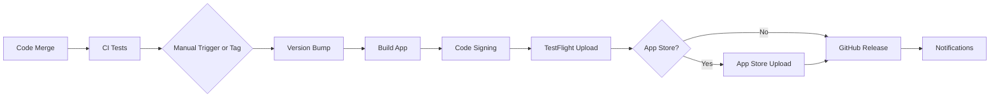

# Release Management Guide

## Table of Contents

- [Overview](#overview)
- [Release Workflow](#release-workflow)
- [Version Management](#version-management)
- [TestFlight Distribution](#testflight-distribution)
- [App Store Deployment](#app-store-deployment)
- [Release Automation](#release-automation)
- [Emergency Releases](#emergency-releases)
- [Troubleshooting](#troubleshooting)

## Overview

This document outlines the complete release management process for iOS and macOS applications, including automated workflows, version management, and deployment procedures.

### Release Types

- **Development Builds**: Internal testing and development
- **Beta Releases**: External testing via TestFlight
- **Production Releases**: App Store distribution
- **Hotfix Releases**: Critical bug fixes
- **Emergency Releases**: Security patches and critical issues

## Release Workflow

### Automated Release Pipeline

The release process is fully automated through GitHub Actions and Fastlane:



### Release Branches

- **main**: Production-ready code
- **develop**: Integration branch for features
- **release/x.y.z**: Release preparation branches
- **hotfix/x.y.z**: Critical fixes for production

## Version Management

### Semantic Versioning

We follow [Semantic Versioning](https://semver.org/) (MAJOR.MINOR.PATCH):

- **MAJOR**: Breaking changes or significant feature additions
- **MINOR**: New features, backward compatible
- **PATCH**: Bug fixes, backward compatible

### Version Bumping

#### Automated Version Bumping
```bash
# Via GitHub Actions workflow dispatch
gh workflow run release.yml -f version_bump=patch
gh workflow run release.yml -f version_bump=minor
gh workflow run release.yml -f version_bump=major
```

#### Manual Version Bumping
```bash
# Using Fastlane
bundle exec fastlane ios increment_version type:patch
bundle exec fastlane ios increment_version type:minor
bundle exec fastlane ios increment_version type:major

# Using scripts
./scripts/prepare-release.sh patch
./scripts/prepare-release.sh minor
./scripts/prepare-release.sh major
```

### Build Number Management

Build numbers are automatically incremented based on TestFlight builds:

```bash
# Automatic build number increment
bundle exec fastlane ios increment_build
```

## TestFlight Distribution

### Automated TestFlight Upload

#### Via GitHub Actions
```bash
# Trigger TestFlight deployment
gh workflow run release.yml -f deployment_target=testflight
```

#### Via Fastlane
```bash
# iOS TestFlight
bundle exec fastlane ios beta

# macOS TestFlight
bundle exec fastlane mac beta

# Both platforms
bundle exec fastlane beta_all
```

### Beta Testing Configuration

#### Internal Testing Groups
- **Internal Testers**: Development team
- **QA Team**: Quality assurance testers
- **Product Team**: Product managers and stakeholders

#### External Testing Groups
- **Beta Users**: Selected external testers
- **Power Users**: Advanced users for feedback

### TestFlight Metadata

Update TestFlight release notes in the workflow:

```yaml
changelog: |
  🐛 Bug Fixes:
  - Fixed crash on app launch
  - Resolved memory leak in image processing

  ✨ New Features:
  - Added dark mode support
  - Improved performance

  📱 Platform Updates:
  - iOS 17 compatibility
  - New widget support
```

## App Store Deployment

### Automated App Store Submission

#### Via GitHub Actions
```bash
# Deploy to App Store
gh workflow run release.yml -f deployment_target=appstore
```

#### Via Fastlane
```bash
# iOS App Store
bundle exec fastlane ios release

# macOS App Store
bundle exec fastlane mac release
```

### App Store Metadata

#### Metadata Management
- **Fastlane Deliver**: Automated metadata upload
- **Screenshots**: Automated screenshot generation
- **App Store Connect**: Manual review and submission

#### Required Metadata
- App description and keywords
- Screenshots for all device sizes
- App icon and marketing materials
- Privacy policy and terms of service
- App Store rating and content descriptors

### App Store Review Process

#### Preparation Checklist
- [ ] App follows App Store Guidelines
- [ ] All features work as described
- [ ] Privacy policy is updated
- [ ] App metadata is accurate
- [ ] Screenshots represent current app state
- [ ] Testing on all supported devices

#### Submission Process
1. **Automated Upload**: Fastlane uploads build and metadata
2. **Manual Review**: Check App Store Connect for accuracy
3. **Submit for Review**: Initiate Apple's review process
4. **Monitor Status**: Track review progress
5. **Release**: Configure release timing

## Release Automation

### Automated Scripts

#### Release Preparation
```bash
# Prepare release with version bump
./scripts/prepare-release.sh minor

# What it does:
# - Creates release branch
# - Bumps version number
# - Updates changelog
# - Creates pull request
```

#### Post-Release Tasks
```bash
# Post-release cleanup and setup
./scripts/post-release.sh

# What it does:
# - Merges release branch
# - Creates Git tag
# - Updates development branch
# - Sends notifications
```

### GitHub Actions Workflows

#### Release Workflow (`release.yml`)
- **Triggers**: Git tags, manual dispatch
- **Actions**: Build, test, deploy, create release
- **Outputs**: App binaries, release notes, notifications

#### Version Bump Workflow
```yaml
name: Version Bump
on:
  workflow_dispatch:
    inputs:
      version_type:
        description: 'Version bump type'
        required: true
        default: 'patch'
        type: choice
        options: [patch, minor, major]
```

### Continuous Deployment

#### Automated Deployment Pipeline
1. **Code Push**: Developer pushes to main branch
2. **CI Tests**: Automated testing pipeline runs
3. **Build**: App is built and signed
4. **TestFlight**: Automatic upload to TestFlight
5. **Notifications**: Team is notified of new build

#### Environment Configuration
```bash
# Production environment
DEPLOYMENT_ENVIRONMENT=production
AUTO_DEPLOY_TESTFLIGHT=true
AUTO_DEPLOY_APPSTORE=false

# Staging environment
DEPLOYMENT_ENVIRONMENT=staging
AUTO_DEPLOY_TESTFLIGHT=true
AUTO_DEPLOY_APPSTORE=false
```

## Emergency Releases

### Hotfix Process

#### 1. Create Hotfix Branch
```bash
# Create hotfix branch from main
git checkout main
git pull origin main
git checkout -b hotfix/1.2.3

# Make critical fixes
git add .
git commit -m "Fix critical security vulnerability"
git push origin hotfix/1.2.3
```

#### 2. Deploy Emergency Release
```bash
# Fast-track deployment
gh workflow run release.yml \
  -f deployment_target=testflight \
  -f version_bump=patch \
  -f emergency=true
```

#### 3. Expedited Review
- Contact Apple for expedited review
- Provide detailed explanation of critical fix
- Monitor review status closely

### Security Patches

#### Critical Security Issues
1. **Immediate Response**: Fix within 24 hours
2. **Emergency Build**: Deploy to TestFlight immediately
3. **App Store Submission**: Submit for expedited review
4. **User Communication**: Notify users of security update

#### Security Release Checklist
- [ ] Security issue confirmed and understood
- [ ] Fix implemented and tested
- [ ] Security team approval obtained
- [ ] Emergency deployment authorized
- [ ] App Store expedited review requested
- [ ] Security advisory prepared (if needed)
- [ ] User communication plan activated

## Monitoring and Analytics

### Release Metrics

#### Key Performance Indicators
- **Build Success Rate**: Percentage of successful builds
- **TestFlight Adoption**: Beta user engagement
- **App Store Rating**: User feedback and ratings
- **Crash Rate**: App stability metrics
- **Download Numbers**: Release performance

#### Monitoring Tools
- **Xcode Cloud**: Build and test analytics
- **App Store Connect**: Download and rating data
- **Crashlytics**: Crash reporting and analysis
- **TestFlight**: Beta testing metrics

### Release Health Monitoring

#### Post-Release Monitoring
1. **First 24 Hours**: Monitor for critical issues
2. **First Week**: Track user adoption and feedback
3. **First Month**: Analyze performance metrics

#### Alert Triggers
- Crash rate above 0.5%
- App Store rating below 4.0
- Significant increase in support tickets
- Performance degradation alerts

## Rollback Procedures

### App Store Rollback

#### When to Rollback
- Critical bugs affecting all users
- Security vulnerabilities discovered
- Data corruption issues
- Compliance violations

#### Rollback Process
1. **Assess Impact**: Determine severity of issues
2. **Remove from Sale**: Disable app downloads
3. **Previous Version**: Submit previous stable version
4. **User Communication**: Notify users of temporary removal
5. **Fix and Redeploy**: Address issues and redeploy

### TestFlight Rollback

#### Stop Beta Distribution
```bash
# Stop current TestFlight distribution
spaceship::TestFlight::Build.find(build_number: current_build).expire!
```

#### Revert to Previous Build
- Promote previous stable build
- Update release notes with rollback information
- Notify beta testers of version change

## Documentation and Communication

### Release Notes Template

```markdown
## Version X.Y.Z - Release Date

### 🎉 What's New
- Major new features and improvements

### 🐛 Bug Fixes
- Fixed crash when opening camera
- Resolved sync issues with iCloud

### 🔒 Security
- Enhanced data encryption
- Updated security protocols

### 📱 Platform Support
- iOS 17 compatibility
- New iPad Pro support

### 🏗️ Under the Hood
- Performance improvements
- Code optimizations
```

### Team Communication

#### Release Announcements
- **Internal Slack**: Development team notifications
- **Company-wide**: Major release announcements
- **External Blog**: Public release communications
- **Social Media**: Marketing and user engagement

#### Stakeholder Updates
- **Weekly**: Release progress reports
- **Pre-Release**: Stakeholder preview and feedback
- **Post-Release**: Performance metrics and feedback summary

## Tools and Integrations

### Required Tools

#### Development Tools
- **Xcode**: Latest stable version
- **Fastlane**: Release automation
- **Git**: Version control
- **Ruby/Bundler**: Fastlane dependencies

#### CI/CD Tools
- **GitHub Actions**: Automated workflows
- **App Store Connect API**: Automated submissions
- **Fastlane Match**: Code signing management

### Integrations

#### Notification Services
- **Slack**: Team notifications
- **Microsoft Teams**: Enterprise notifications
- **Email**: Stakeholder updates

#### Monitoring Services
- **Firebase Crashlytics**: Crash reporting
- **App Store Connect**: App analytics
- **Custom Dashboard**: Release metrics

## Best Practices

### Release Quality

#### Testing Requirements
- All automated tests must pass
- Manual testing on primary devices
- Beta testing period (minimum 48 hours)
- Stakeholder approval for major releases

#### Code Quality Gates
- Code review requirements
- Security scanning results
- Performance benchmarks
- Documentation updates

### Release Timing

#### Optimal Release Windows
- **Tuesday-Thursday**: Best for user adoption
- **Avoid Fridays**: Reduced monitoring capability
- **Consider Holidays**: Plan around major holidays
- **Time Zones**: Consider global user base

#### Release Frequency
- **Major Releases**: Monthly or bi-monthly
- **Minor Updates**: Weekly or bi-weekly
- **Patch Releases**: As needed for bug fixes
- **Security Updates**: Immediate deployment

### Risk Management

#### Release Risk Assessment
- **High Risk**: Major feature releases
- **Medium Risk**: Significant updates
- **Low Risk**: Bug fixes and minor improvements

#### Mitigation Strategies
- Gradual rollout for high-risk releases
- Feature flags for new functionality
- A/B testing for UI changes
- Rollback procedures documented and tested

## Troubleshooting

### Common Issues

#### Build Failures
```bash
# Clean build environment
bundle exec fastlane clean_all

# Reset code signing
bundle exec fastlane setup_signing

# Rebuild with verbose output
bundle exec fastlane ios build_release --verbose
```

#### TestFlight Upload Failures
- Check App Store Connect API credentials
- Verify build signing certificates
- Review TestFlight compliance requirements
- Check for duplicate build numbers

#### App Store Submission Issues
- Review App Store Guidelines compliance
- Check metadata and screenshots
- Verify privacy policy links
- Review content rating accuracy

### Support Contacts

#### Internal Support
- **Release Team**: release-team@company.com
- **DevOps**: devops@company.com
- **Security Team**: security@company.com

#### External Support
- **Apple Developer Support**: Technical issues
- **App Store Connect**: Submission problems
- **Fastlane Community**: Tool-specific help

---

## Quick Reference

### Essential Commands

```bash
# Full release to TestFlight
bundle exec fastlane ios beta

# Deploy to App Store
bundle exec fastlane ios release

# Version management
bundle exec fastlane ios increment_version type:patch

# Clean and rebuild
bundle exec fastlane clean_all && bundle exec fastlane ios build_release

# Emergency hotfix deployment
gh workflow run release.yml -f deployment_target=testflight -f emergency=true
```

### Environment Variables Checklist

Required for all releases:
- [ ] `APPLE_ID`
- [ ] `DEVELOPMENT_TEAM`
- [ ] `APPSTORE_TEAM_ID`
- [ ] `MATCH_PASSWORD`
- [ ] `MATCH_GIT_URL`
- [ ] `MATCH_GIT_BASIC_AUTHORIZATION`

### Pre-Release Checklist

- [ ] All tests passing
- [ ] Code review completed
- [ ] Version number updated
- [ ] Release notes prepared
- [ ] Beta testing completed
- [ ] Stakeholder approval obtained
- [ ] App Store metadata updated
- [ ] Rollback plan prepared

---

*For questions about the release process, contact the Release Engineering team or refer to the troubleshooting section above.*